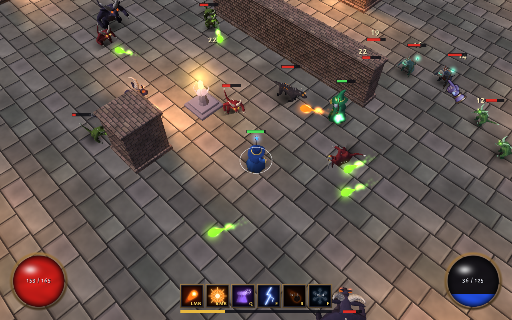

# Carbon Crawler

A small networked action-RPG built on CCP's open-source [Carbon](https://github.com/carbonengine) engine (Blue,
Destiny, Trinity, carbon-io, carbon-audio), using nothing but the public vcpkg registry. It's an engine spike: an attempt
to make something that plays nothing like EVE (fast, direct control and crowds of animated monsters) on the same stack.



You play a mage in a torch-lit hall. Waves of imps, spitters, brutes, hounds, shamans, bloaters and shieldbearers come
at you, with a Warlord every fifth wave. You level up, pick upgrades, and ready up at the shrine between waves. Several
players can join one server, and AI mages can fill in for missing friends.

- **Server-authoritative simulation.** Destiny runs the world at 10 ms ticks and replicates it with destiny.net, and
  a state channel carries HP, mana and events. Your own mage is predicted locally, so input shows up on the next frame.
- **All content comes from scripts.** One headless Blender script builds every mesh, rig, animation, texture and
  placeable. Sounds and music come from a small synthesizer, and the HUD icons from a drawing script.
- **Animation without Granny.** Trinity's skinned animation needs Granny, which the public build leaves out, so
  Blender bakes each clip into a vertex animation texture and a shader plays it.

## What you need

- Windows 10 or 11 with a DirectX 11 GPU
- Visual Studio 2022 with the v143 (MSVC 14.44) toolset and ATL, and Windows SDK 10.0.26100
- Git (with Git Bash), PowerShell 7, and Python 3.12 (`py -3.12`) with `numpy`, `scipy` and `pillow` for the tools
- [Blender 5.2](https://www.blender.org/), only if you want to rebuild the art (the built assets are committed)

## Setup

Clone to a short path such as `C:\dev\carbon-crawler`: the Python build nests deep folders under `vendor/` and fails
past Windows' 260-character path limit. Then, from Git Bash in the repository folder:

```sh
git clone https://github.com/microsoft/vcpkg.git vendor/vcpkg && vendor/vcpkg/bootstrap-vcpkg.bat -disableMetrics
git clone https://github.com/carbonengine/vcpkg-registry.git vendor/vcpkg-registry
bash install_deps.sh                # builds Python 3.12, Blue, Destiny, Trinity (dx11) and audio: ~40 min the first time
pwsh -File build_shaders.ps1        # compiles res/graphics/effect/**/*.fx
bash tools/fetch_testbanks.sh       # the Wwise test banks from carbonengine/audio
py -3.12 tools/make_arpg_audio.py   # synthesizes the game's sounds and music into copies of those banks
```

`install_deps.sh` fetches the registry's `git@github.com:` URLs over HTTPS, so no SSH key is needed.

## Play

```bat
run_arpg_server.cmd
run_arpg_client.cmd                 (once per player)
run_arpg_client.cmd companion 2     (you plus two AI mages)
set NET_HOST=<server ip>            (on another machine, before starting the client)
```

| Key | Action |
|---|---|
| WASD | Move |
| Left mouse | Firebolt at the cursor |
| Right mouse | Nova |
| Q | Blink toward the cursor |
| E / R / F | Chain lightning, meteor, frost wave (unlocked at levels 2, 3 and 4) |
| Shift | Roll: a quick dodge you can't be hit during |
| Space | Jump over slams and meteor rain |
| U | Upgrades (when you have some to spend) |
| Tab | Switch to mouse controls (hold left to move) |
| Esc | Menu, with music and sound volume |

Click a spell slot to put a different spell on it. Between waves, walk to the glowing shrine to ready up.

`py -3.12 tools/package.py --zip` builds a standalone copy in `dist/carbon-crawler` (and a zip), with Python, the engine
DLLs and the Visual C++ runtime included, for machines without the build tools.

## How it's put together

| Where | What |
|---|---|
| `demo/arpg_world.py` | Content as data: `SPELLS`, `UPGRADES` and the enemy `KINDS` (bundles of behaviours such as `melee`, `slam`, `charge`, `mend`, `burst`, `shield`) |
| `demo/arpg_server.py`, `demo/arpg_game/` | Networking and the tick; one component per behaviour per entity, and plain system functions over them |
| `demo/arpg_client.py`, `demo/arpg_view/` | Prediction, HUD and input; an event bus feeding actors, effects, sounds and on-screen feedback |
| `demo/arpg_brain.py` | The AI mage, used by `arpg_companion.py` and by the client's autopilot (`ARPG_AUTOPLAY=1`) |
| `tools/blender/` | The Blender build: models, rigs, clips (`arpg_anims.py`), texture bakes |
| `tools/arpg_sounds.py`, `tools/arpg_music.py` | Sound recipes and the three music loops |
| `res/graphics/effect/game/` | The shaders: lighting, vertex animation, particles, halos |

Destiny owns position, movement and collision. The state channel carries lasting fields (HP, mana, level) and one-shot
events (`state.event(id, "slam", radius=..., windup=...)`), and clients turn both into what you see and hear.

Sounds are packed into one slot of a copy of the Wwise test banks, and the client seeks to the one it wants, so new
sounds need no Wwise authoring. `ARPG_AUDIO=0` mutes the client, and `ARPG_MUSIC=0` mutes only the music.

### Tools

| Command | What |
|---|---|
| `blender -b --factory-startup -P tools/blender/build_arpg_assets.py` | Rebuilds every model, animation and texture in `res/arpg/` |
| `py -3.12 tools/make_arpg_ui.py` | Redraws the HUD textures in `res/arpg/ui` |
| `tools/arpg_waves_test.sh [companions] [seconds]` | Headless game: server and AI companions, printing the server's wave reports |
| `tools/arpg_capture.sh [name] [frame]` | Server, bot and client on a test port; saves one frame to `demo/out/<name>.png` |
| `run_demo.ps1 -Script demo\model_gallery.py` | The placeables in a row (`GALLERY_LINEUP=hound,shaman`) |
| `run_demo.ps1 -Script demo\anim_sheet.py` | Every clip as rows of frozen poses (`SHEET_MODELS=hound:hound`) |
| `run_demo.ps1 -Script demo\fx_sheet.py` | Every particle effect at a few ages |

Server settings are environment variables: `ARPG_MODE=waves|sandbox`, `ARPG_FIRST_WAVE`, `WAVE_SIZE=base,step`,
`INTERMISSION_S`, `ENEMY_MIX` (sandbox), `TICK_MS` and `NET_PORT`. Client settings: `NET_HOST`, `NET_PORT`,
`ARPG_CONTROLS=wasd|mouse`, `ARPG_PREDICT=1|0`, and `ARPG_DEBUG=1` for the network panel (also F3).

Test scripts use port 47410, so they don't collide with a server on the default port 47400.

`docs/upstream_issues.md` collects the problems found in the Carbon packages along the way, written up as draft bug
reports.

## Licenses

The project's own code and content are under the MIT license in `LICENSE`. The game text uses Alegreya Sans and Cinzel
(SIL Open Font License, `res/fonts/OFL_*.txt`). `res/ui/fonts/arialuni.ttf` is DejaVu Sans, saved at Trinity's fallback
font path (DejaVu license, `res/fonts/LICENSE_DEJAVU`). The Carbon packages, Python and the Wwise runtime come from the
vcpkg registry under their own licenses.
